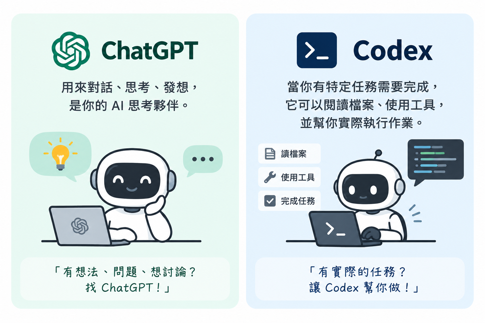
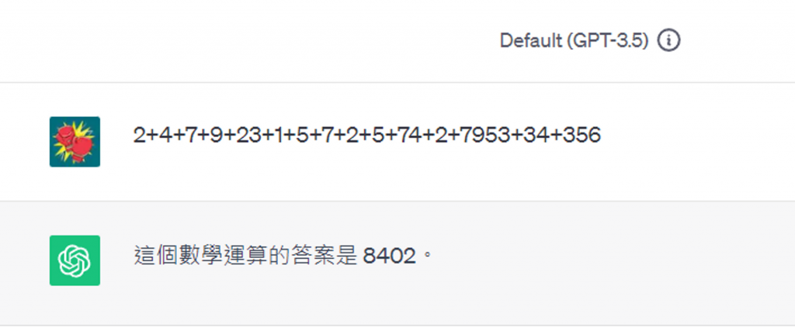
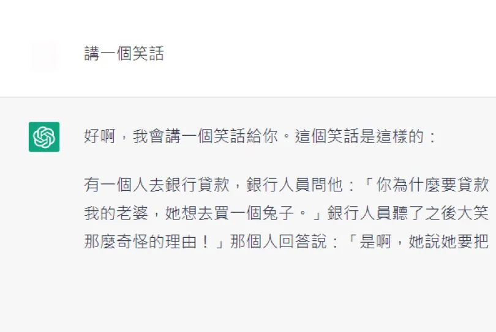
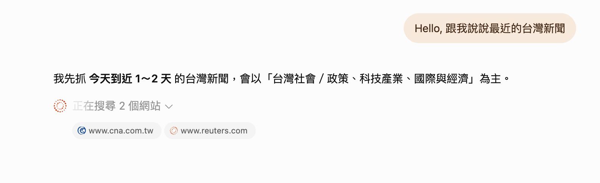
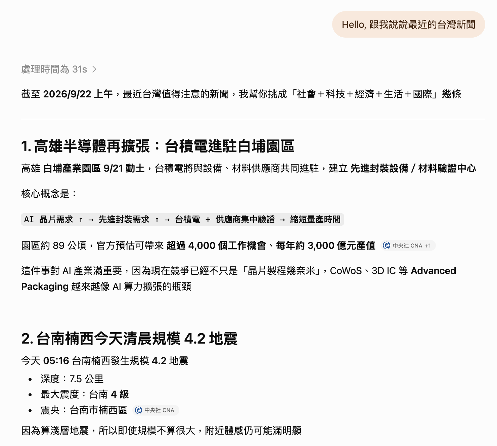
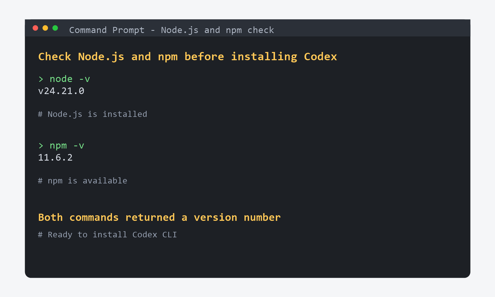
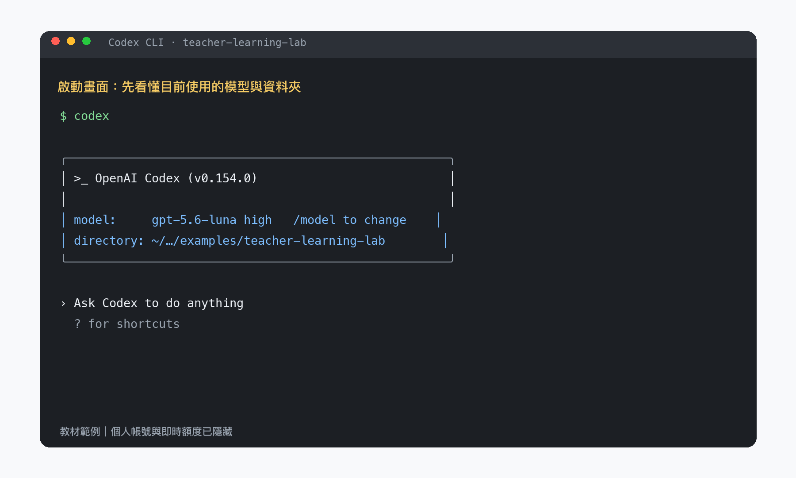
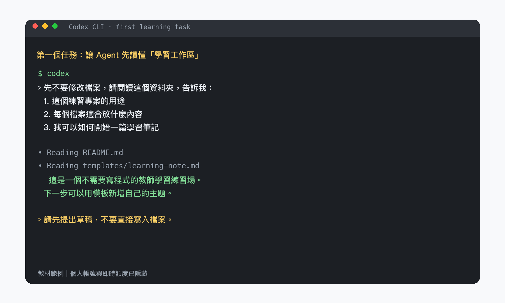
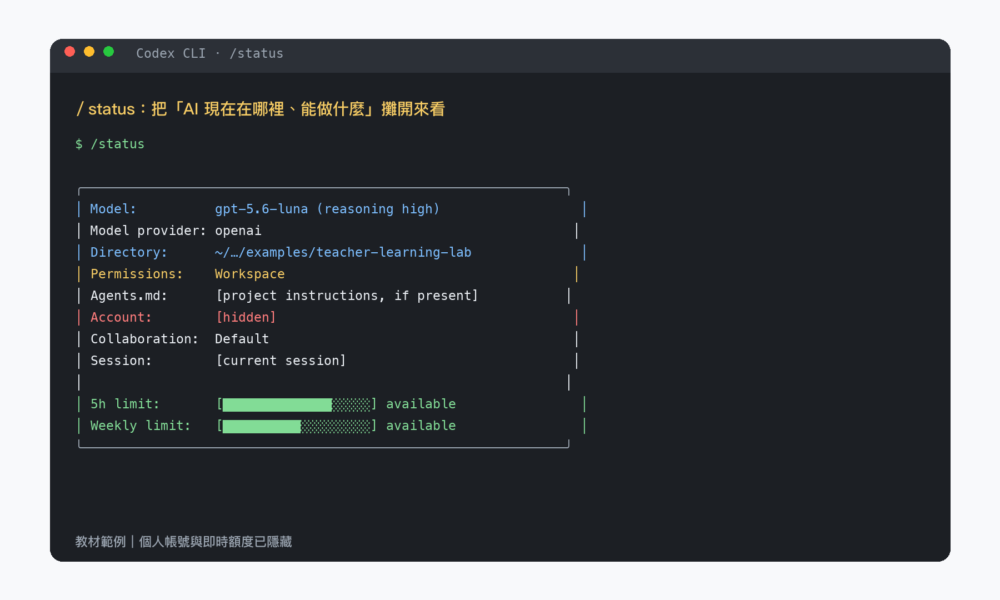

# Agentic AI 實戰：從 Chat 到 Codex 協作工作流

## 這堂課會學到什麼？

這堂課會帶大家認識 Agentic AI 工具，並實際理解 ChatGPT 與 Codex 的使用情境。

這堂課以實際操作 Codex 為主，跟著以下流程進行：

`安裝 → 啟動 → 開始 Session → 查看 Status／Usage → 完成第一個 Codex 任務`

1. ChatGPT 和 Codex 的差異
2. 如何開始安裝與使用 Codex
3. 認識 Session、Status、Usage、Token 與 Memory
4. 如何更有效率地使用 Token
5. Skills 與 MCP 是什麼
6. 用一個不需要寫程式的專案，讓 AI 讀懂並畫出專業筆記

---

# ChatGPT、Codex 差在哪？

- **ChatGPT**：適合對話、發想、整理與問答
- **Codex**：適合把任務交給 AI，讓它閱讀檔案、使用工具並協助完成工作



Claude 也有類似分工：
Claude Chat 偏對話；Claude Code 與 CoWork 則更接近「可以協作執行任務」的工具。

要理解這些工具的差異，可以先看 LLM 的演進：`文字生成 → 推理 → 使用工具 → 自主執行任務`

## LLM 的開始：看起來合理，不一定正確

2022 年 ChatGPT 出現後，LLM 正式走進大眾生活。

它很會生成流暢、看起來有道理的回答；但不一定真的理解內容，也可能答錯或編造資訊。這種現象常被稱為 **AI 幻覺（Hallucination）**。

例如，請它回答一個看似簡單的算術問題：

`2 + 4 + 7 + 9 + 23 + 1 + 5 + 7 + 2 + 5 + 74 + 2 + 7953 + 34 + 356 = ?`



實際答案是 8484。這個例子用來說明：語氣很肯定的回答，不一定代表模型真的完成了驗算。

圖片來源：[IT 邦幫忙：向 ChatGPT 對話的提問技巧與問題限制](https://ithelp.ithome.com.tw/articles/10315994)

早期模型也常出現回答中斷或失去上下文的情況：



圖片來源：[Cheers 快樂工作人](https://www.cheers.com.tw/article/article.action?id=5101461)

## 為什麼會有幻覺？

可以先把 LLM 簡單理解為：

`前面的文字 → 預測下一個 Token → 持續預測下一個 Token`

它會根據訓練時看過的大量文字，從相似的語言模式中預測下一個最可能出現的 Token。

所以它很擅長產生「像答案」的文字；至於是否驗算，則取決於模型能力、目前模式，以及它是否使用計算器或程式碼等工具。

`很像正確答案 ≠ 真正知道答案`

## LLM 的進化：從回答到推理

後來模型開始加入「Thinking」或推理能力



簡單來說，模型不只直接回答，而是先把問題拆成幾個步驟，再整理出答案
像 CoT（Chain of Thought）就是讓模型逐步處理複雜問題的方法



## LLM 轉變成 Agentic AI 的關鍵

當模型可以使用工具，AI 就不只是「回答問題」，而是能開始「完成任務」。

例如它可以：

- 讀取專案檔案與文件
- 搜尋資料或查詢系統
- 撰寫、修改與測試程式
- 根據結果調整下一步

這類具備目標、工具與執行能力的 AI，我們通常稱為 **Agentic AI**。

---

# ChatGPT 與 Codex：使用情境對照

| 工具    | 最適合做什麼                     | 典型例子                             |
| ------- | -------------------------------- | ------------------------------------ |
| ChatGPT | 對話、構思、解釋、整理           | 幫我整理會議重點、寫一份大綱         |
| Codex   | 讀取工作環境、使用工具、執行任務 | 幫我修改這個專案、檢查錯誤、更新文件 |

兩者不是誰取代誰，而是不同的工作方式：

`ChatGPT 幫你想清楚 → Codex 幫你在工作環境中完成`

## 開始使用 Codex

這堂課主要使用 **Codex CLI**。

### 先安裝 Node.js

Codex CLI 會透過 Node.js 與 npm 安裝。第一次上課時，請先到官方下載頁安裝 **LTS（長期支援版）**：

[下載 Node.js LTS](https://nodejs.org/en/download/)

安裝時使用預設選項即可。
安裝完成後，記得重開當前的 Terminal，讓新的指令路徑生效。

接著確認 Node.js 與 npm 已經可以使用

```bash
# 確認 Node.js 已經安裝
$ node -v

# 確認 npm 已經可以使用
$ npm -v
```



如果兩個指令都有顯示版本號，就可以繼續安裝 Codex。
若出現「找不到指令」，先重新開啟終端機；仍然無法使用時，再重新執行 Node.js 安裝程式。

### 安裝並啟動 Codex

在命令提示字元輸入：

```bash
# 安裝最新版 Codex CLI
$ npm install -g @openai/codex@latest
```

安裝完成後輸入：

```bash
# 啟動 Codex CLI
$ codex
```

第一次啟動時，依照畫面指示登入 ChatGPT 帳號即可。

可以把流程簡單理解成：

`下載 Node.js LTS → 確認 node/npm → 安裝 Codex → codex → 登入 → 開始 Session`



圖片說明：這個畫面先看兩件事——目前使用哪個 **Model**，以及 Codex 正在工作的 **Directory**。本課的 CLI 圖片以實際輸出為基礎，帳號、Session ID 與即時額度已隱藏。

畫面中的 Model 名稱會隨版本與帳號而變；課堂重點是會讀懂欄位，不需要背住特定模型名稱。

官方參考：[OpenAI Codex](https://openai.com/codex/)、[Using Codex with your ChatGPT plan](https://help.openai.com/en/articles/11369540-using-codex-with-your-chatgpt-plan)

### 動手試試看：讓 Codex 看懂專案

課堂先使用教材附的練習專案，不要一開始就把 Codex 帶進含有重要資料的個人專案。這個專案只有 Markdown 檔案，適合先練習「讓 Agent 讀懂工作區」：

`examples/teacher-learning-lab/`

請先在命令提示字元切換到教材根目錄，再進入練習專案：

```bash
# 進入課堂練習專案
$ cd examples/teacher-learning-lab

# 啟動 Codex
$ codex
```

如果你目前已經在教材根目錄，也可以直接執行：

```bash
# 如果目前已經在教材根目錄，直接執行：
$ cd examples/teacher-learning-lab
$ codex
```

接著輸入：

```markdown
先不要修改任何檔案

請閱讀這個專案，告訴我：
1. 這個專案是做什麼的
2. 使用哪些主要技術
3. 程式進入點在哪裡
```

請觀察 Codex 如何：

`理解任務 → 查看檔案 → 搜尋程式碼 → 整理結果`

這是最基本的 Agentic 工作方式。ChatGPT 通常需要你先把資料貼進對話；Codex 則可以自己進入工作環境找資訊。

第一次練習的原則是：**先讀取、先說明，不要急著修改檔案。** 等大家看懂 Codex 如何判斷工作目錄、尋找檔案與整理結果後，再進行後面的筆記任務。

---

## Session、Status、Usage、Token 與 Memory

### Session

一次 Codex 工作對話的「工作階段」

你在這個 Session 裡下指令、讀檔案、修改程式、執行測試
Codex 會保留這段對話中的上下文，方便持續處理同一件事情

`開啟 Session → 描述任務 → Codex 修改 / 測試 → 持續追問`

Session 可以先理解成「這一次協作的工作桌」：你在同一個 Session 裡逐步補充背景、提出問題、看結果，再決定下一步。

對非工程背景的使用者來說，Session 最重要的不是記住指令，而是保留學習脈絡：

- 我現在想學什麼
- 我已經知道什麼
- 哪些地方還不懂
- Agent 已經整理出什麼
- 下一步要練習或查證什麼

### 動手試試看：先讓 Agent 讀懂工作區

在課程提供的練習專案中啟動 Codex：

```bash
# 進入課程提供的練習專案
$ cd examples/teacher-learning-lab

# 啟動 Codex
$ codex
```

輸入：

```markdown
先不要修改檔案，請閱讀這個資料夾，告訴我：
1. 這個練習專案的用途
2. 每個檔案適合放什麼內容
3. 我可以如何開始一篇學習筆記
請先提出理解與建議，不要直接寫入檔案。
```



這個任務的重點是觀察 Agent 的工作順序：**先讀取 → 形成理解 → 回報 → 等待下一步**。先不要修改檔案，可以讓初學者清楚分辨「我要求 AI 做什麼」與「AI 實際做了什麼」。

---

### Status

查看目前 Codex 的執行環境資訊

通常可以看到：

- 使用中的 Model
- Reasoning 等級
- 目前工作目錄
- 權限模式
- Session ID
- 帳號方案與使用狀態

可以把它理解成 Codex 的「系統資訊頁」



可以用下面這張表讀 `/status`：

| 欄位        | 可以怎麼理解                                     |
| ----------- | ------------------------------------------------ |
| Model       | 目前使用哪個模型，以及推理設定                   |
| Directory   | Agent 目前工作的資料夾；這會影響它能讀到哪些檔案 |
| Permissions | Agent 可以做哪些操作，是否需要你核准             |
| Agents.md   | 專案是否有額外的工作規則                         |
| Session     | 這次協作的識別資訊                               |
| Usage       | 目前可用的時間／額度摘要；不是單一問題的分數     |

### 動手試試看：查看目前環境

在 Codex 中執行：

```text
/status
```

找出並記下：

- Model
- Directory
- Permission

想一想：Codex 現在使用哪個模型？正在看哪個資料夾？可以做哪些事情？

這裡的學習目標不是背欄位名稱，而是養成一個習慣：**在要求 Agent 做事前，先確認它在哪裡、看得到什麼、能不能修改。**

---

### Usage

查看目前 Codex 的使用額度

通常包含：

- 已使用多少額度
- 剩餘多少額度
- 額度何時 Reset
- 是否還有額外的 Usage Reset

它回答的是：

> 「我現在還能用多少 Codex？」

在目前的 CLI 畫面中，Usage 會和 `/status` 一起呈現時間範圍與剩餘量。課堂上只要先分清楚：

- **Usage** 是帳號／方案的使用額度
- **Token** 是模型處理文字與檔案的單位
- 使用很多 Token 不一定等於立刻用完所有 Usage；兩者是不同層次的概念

教學時建議不要要求學生記住精確計算方式，而是讓他們在任務前後觀察：讀很多檔案、來回很多次、輸出很長內容，通常都會讓工作量增加。

---

### Token

LLM 處理文字時使用的基本單位

你的 Prompt、程式碼、Codex 讀到的檔案，以及 Codex 的回答
都會被轉換成 Token

```text
Prompt + Code + Files + History
              ↓
            Token
              ↓
             LLM
```

Session 越長、讀取的檔案越多
需要處理的 Token 通常也會越多

### 動手試試看：讓 Prompt 限制範圍

比較下面兩個 Prompt：

#### Prompt A

```markdown
幫我整理這個學習主題
```

#### Prompt B

```markdown
只根據 notes/cognitive-load-theory.md
整理成：
- 1 個核心概念
- 1 個學生可能的錯誤理解
- 2 個檢查理解的問題
不要新增檔案，也不要加入原筆記沒有提到的事實
```

請問大家：哪一個比較容易讓 Agent 少走冤枉路？

通常範圍越清楚，Agent 就越不需要搜尋無關檔案、做額外推理或呼叫多餘工具，也就能減少 Token 與 Tool Calls。對師培生而言，這就像備課時說清楚「只看這一份草稿、整理成這三種結果」，比「幫我處理一下」更容易得到可用的內容。

---

### Memory

Codex 在工作過程中保留的「上下文資訊」

例如：

- 前面討論過什麼
- 專案有哪些限制
- 已經做過哪些修改
- 接下來正在處理什麼

讓你不用每次都重新解釋整個專案

在這堂課可以把 Memory 分成兩層：

1. **Session 內的記憶**：目前這次對話中已經談過的內容、限制與決定。
2. **專案裡的記憶**：寫在 `README.md`、`AGENTS.md`、模板與筆記中的背景資料。換一個 Session 後，這些檔案仍然可以被重新讀取。

因此，Memory 不代表 AI 永遠記得所有事情。對初學者最實用的做法，是把重要規則與學習成果寫成檔案，而不是只留在聊天裡。

簡單區分：

`Session = 這次工作的容器``Memory = 容器裡保留下來的上下文``Token = 模型實際拿來理解這些資訊的單位`

- **Session**：一次持續進行的協作工作。AI 會保留這次工作需要的上下文。
- **Status**：目前 Codex 的執行環境資訊，例如 Model、Reasoning、Directory、Permissions 與 Session。
- **Usage**：這次工作使用了多少模型資源與額度。
- **Token**：模型讀取與產生文字的基本單位，不完全等於中文字數或英文單字數。
- **Memory**：可延續的偏好或背景資訊，讓 AI 不需要每次都從零開始理解你。

## 給師培生的練習專案：讓 Agent 讀懂專業筆記

本課提供一個純 Markdown 的練習專案：[teacher-learning-lab](../examples/teacher-learning-lab/)。它不需要寫程式，適合正在修習教育心理學、教育社會學、教育哲學等師培課程的學生。

練習情境是：你手上有六份教育專業知識筆記，想快速掌握不同理論的核心概念、概念之間的關係，以及哪些地方還需要查證。請讓 Agent 先掃描全部筆記，再選一份用 ASCII 整理，最後使用 Skill 畫成知識圖。

六份筆記包括：

- 認知負荷理論
- 近側發展區與鷹架
- 布魯姆教育目標分類學
- 杜威的經驗教育
- 隱性課程
- 文化資本

這個練習場的輸出分成三處：

- `notes/`：六份原始專業筆記
- `outputs/`：第二個練習產生的 ASCII 知識結構
- `diagrams/`：第三個練習產生的 HTML、SVG 或 PNG 圖檔

### 三個任務

#### 任務 1：讓 Codex 看懂專案

```markdown
先不要修改任何檔案。

請閱讀這個練習專案，告訴我：
1. 這個專案是做什麼的？
2. notes/ 裡有哪六份專業筆記？
3. 請依照教育心理學、教育哲學、教育社會學或教學設計分類。
4. 哪兩份筆記最適合放在一起比較？為什麼？
5. 三個練習的順序與關係是什麼？
```

接著輸入：

```markdown
請閱讀 notes/ 裡的六份專業筆記。

請整理成一張表：
- 筆記名稱
- 所屬領域
- 核心問題
- 3 個專有名詞
- 一個教育情境
- 一個常見誤解

先不要修改任何檔案。
```

#### 任務 2：嘗試畫出 ASCII 知識點

```markdown
請再次閱讀 notes/cognitive-load-theory.md。

請用 ASCII 樹狀結構或箭頭，整理這份筆記的知識點，包含：
1. 中心問題
2. 核心概念
3. 專有名詞
4. 概念之間的關係
5. 教育情境
6. 常見誤解

不要加入原筆記沒有提到的事實。
先把 ASCII 草稿顯示給我，等我確認後再寫入：
outputs/cognitive-load-theory-ascii.md
```

確認內容後：

```markdown
請把剛才確認過的 ASCII 知識結構寫入：
outputs/cognitive-load-theory-ascii.md

只保存 ASCII 結構與必要的簡短說明，不要改寫原本的專業筆記。
```

#### 任務 3：使用 Skill 畫出筆記

先安裝 [diagram-design](https://github.com/cathrynlavery/diagram-design) skill：

```bash
# 加入 diagram-design 的 Plugin Marketplace
$ codex plugin marketplace add cathrynlavery/diagram-design

# 安裝 diagram-design plugin
$ codex plugin add diagram-design@diagram-design
```

重新開啟 Codex Session 後輸入：

```markdown
請閱讀：
- notes/cognitive-load-theory.md
- outputs/cognitive-load-theory-ascii.md

請使用 diagram-design skill，把這份專業知識筆記畫成一張適合初學者理解的知識圖。

要求：
- 先判斷這份筆記適合使用哪一種圖
- 保留中心問題、主要概念與概念之間的關係
- 不要加入筆記中沒有提到的事實
- 先提出圖的設計，再開始產生圖
- 將最後的圖檔保存到 diagrams/
```

這三個任務的核心，是讓 AI 從「答案機器」變成專業知識的理解與視覺化夥伴：**先掃描、再比較、再整理、最後畫出關係**。

### 一個適合師培生的 AI 專業筆記理解循環

`閱讀專業筆記 → 用自己的話理解 → ASCII 整理知識點 → 使用 Skill 產生知識圖 → 回頭檢查是否忠於原文`

最後請師培生反思四件事：

- 我是否真的理解這份專業筆記，而不是只看過一遍？
- ASCII 結構是否保留了原筆記的重點？
- 最後的圖是否讓沒有背景知識的人更容易理解？
- 哪些地方仍然需要回到課本、論文或教師說明確認？

## 如何更有效率地使用 Token

重點不是一味省 Token，而是讓 AI 少走冤枉路。

- 先說清楚目標、檔案範圍與完成標準
- 一次聚焦一個任務，避免在同一個 Session 混入太多主題
- 技術需求可優先使用英文，通常更容易對齊工具與程式語境
- 善用 **Skills**，讓 AI 依既定流程完成特定工作
- 善用工具先讀檔、查資料或執行檢查，不要要求模型憑空猜測
- 注意上下文空間（headroom），長任務可適時整理或切換 Session

## Skills 與 MCP 是什麼？

- **Skills**：AI 的工作指南或標準流程。例如建立簡報、修改文件、檢查程式時，告訴 AI 該怎麼做。
- **MCP**：讓 AI 連接外部工具與資料來源的標準方式。例如連接 Google Drive、GitHub、資料庫或公司內部系統。

可以把它們想成：

`Skills = 工作方法`

`MCP = 可使用的外部工具`

有了 Skills 與 MCP，AI 才能從「會聊天」進一步變成「能一起做事的協作者」。

### 動手試試看：Skill 還是 MCP？

想像以下兩個情境，判斷應該使用 Skill 還是 MCP：

1. 每次 Review PR，都希望 AI 按照公司的 10 條規範檢查。
2. 希望 AI 可以查詢公司的 Jira 或資料庫。

答案：

- 固定的工作方法與檢查流程 → **Skill**
- 連接外部系統、取得資料或執行外部操作 → **MCP**

因此可以記成：

`Skill = 方法；MCP = 工具`
